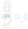

chimney-generator
#################

This generator allows you to create chimney models for SLA printing.

It is made with Python, VTK and `vtkbool <https://github.com/zippy84/vtkbool>`_, my own library for boolean operations.

How can I use it?
*****************

Install Anaconda from https://anaconda.org/, create you own virtual environment with *environment.yml* and then run *generate.py*.

It's a generator, so you can define you own configuration for every model. Just edit the *cfgs* list in *generate.py*.

A typical item of that list looks like this:

.. code:: python

  { 'a': 5,
    'b': 5,
    'seqs': [
      [(2, 2, 2, 2, 2), (3, 4, 3)],
      [(3, 4, 3), (2, 2, 2, 2, 2)]
    ],
    'div_a': 1,
    'div_b': 2,
    's': 5,
    't': 6,
    'phi': math.radians(35.5) }

The meaning of the keys can be seen in the following drawing:

A few words about special keys:

s
  The parameter controls the position of the roof ridge. It must be a value between 0 and *a*.
div_a
  It controls the subdivision of the upper plate (I don't know the correct name for it) in the direction of *a*.
div_b
  Subdivision in the direction of *b*.
seqs
  The seqs parameter controls the pattern of the bricks. It's a list of lists each containing exactly two tuples. Every list in the list stands for a row, from top to bottom of the chimney. The first tuple is in the direction of *a*, the second in direction of *b*. The here defined rows will be repeated until the lower bound of the chimney is reached. A tuple can only contain values of 2, 3 and 4. The 2 stands for a half brick, the 3 for a 3/4 brick and 4 for a full brick. The sums of each values in every first and second tuples must be the same. Otherwise an assertion error will be thrown. The configuration of the example is valid, because the first sums and also the second sums are all 10.

*a*, *b*, *seqs* and *t* must be set in every configuration.

Default values for the parameters are:

.. list-table::
  :widths: auto

  * - f
    - 0.625
  * - e
    - 0.15
  * - h
    - 0.75
  * - g
    - 1
  * - div_a
    - 1
  * - div_b
    - 1
  * - phi
    - 0
  * - s
    - 0

License
*******

Published under the MIT license.

Copyright
*********

2024, Ronald Römer
